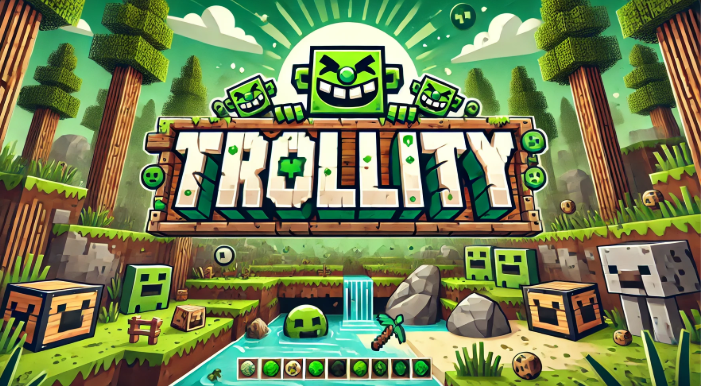

<h1 align="center">Trollity</h1>

  
  
  
  
  

  
  

**A fun and mischievous Minecraft plugin to prank and troll players with a variety of commands.**

---

## Features
- Prank your friends with fun commands like lighting strikes, blindness, and more.
- Configure messages and settings via a simple and intuitive `config.yml` file.
- Works with multiple Minecraft server versions (1.16 - 1.20).

---

## Installation
1. Download the latest release from [PaperMC](https://github.com/CapitainFoxy/Trollity/blob/main/README.md#papermc).
2. Place the `.jar` file in your server's `plugins` directory.
3. Restart your server to load the plugin.

---

## 🔨 Commands
| Command                     | Description                                                 | Permission      |
|-----------------------------|-------------------------------------------------------------|-----------------|
| `/trollity burn <player>`    | Sets the player on fire for 5 seconds.                      | `trollity.use`  |
| `/trollity lightning <player>`| Strikes the player with a lightning bolt.                   | `trollity.use`  |
| `/trollity freeze <player> <sec>`| Freezes the player for the given time in seconds.         | `trollity.use`  |
| `/trollity hunger <player>`  | Sets the player's hunger to a critical level.               | `trollity.use`  |
| `/trollity mobs <player>`    | Spawns 5 random mobs on the player.                         | `trollity.use`  |
| `/trollity blind <player> <sec>`| Blinds the player for the given time in seconds.          | `trollity.use`  |
| `/trollity anvil <player>`   | Drops an anvil 10 blocks above the player.                  | `trollity.use`  |
| `/trollity hurt <player>`    | Critically damages the player.                              | `trollity.use`  |
| `/trollity kill <player>`    | Kills the player but preserves their inventory.             | `trollity.use`  |
| `/trollity help`             | Displays a list of available commands and their descriptions.| `trollity.use`  |

---

## Contributions
Contributions are welcome! Feel free to fork the repository and submit a pull request. Please make sure your code follows the project's style and conventions.

---

## PaperMC
Download the plugin on [PaperMC](https://hangar.papermc.io/CapitainFoxy/Trollity).

---

## License
This project is licensed under the Apache License 2.0. See the [LICENSE](LICENSE) file for more details.

---

## Support
For support or feature requests, please use the [Issues](https://github.com/CapitainFoxy/Trollity/issues) tab.

